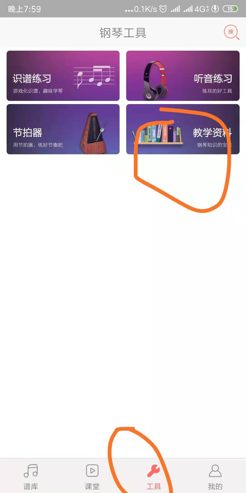
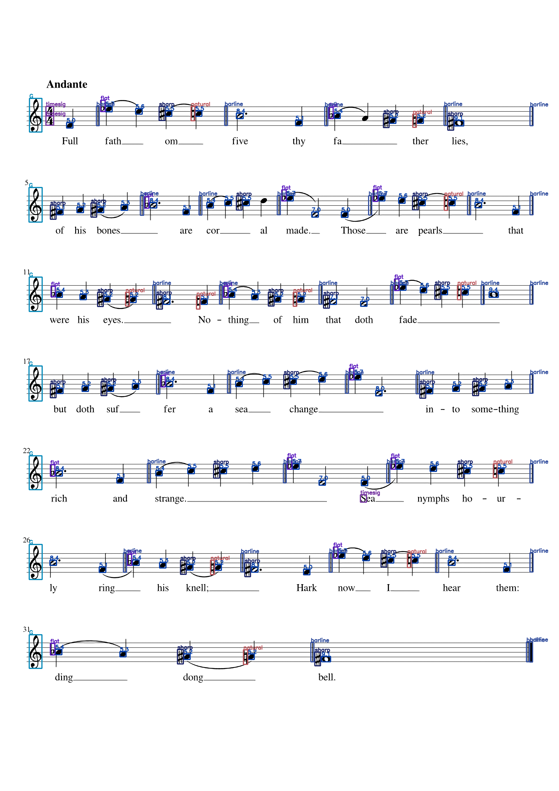
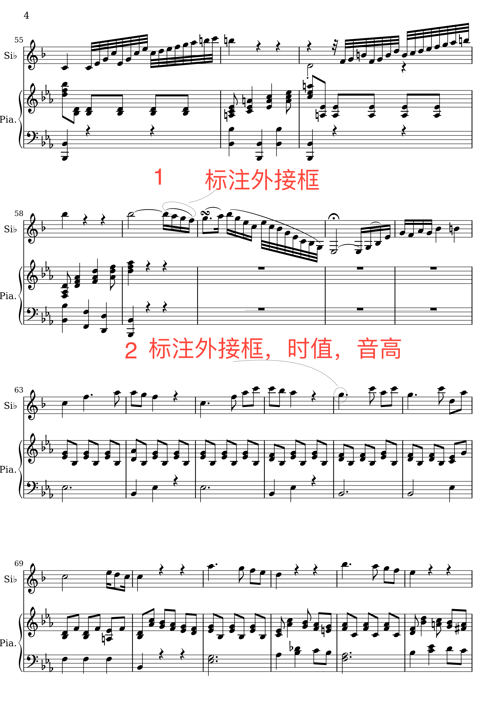

### 手写体乐谱标注

#### 基本条件

- 标准工具  labelme   https://github.com/wkentaro/labelme

- 需要知道相关的乐谱知识，推荐软件：钢琴谱大全

  

  ```
  进行标注工作前，需要了解相关的乐谱信息，知道音符的时值和音高信息怎么计算的，以及休止符的时值，每个符号的作用。
  同学们应该有相应的了解
  ```

  #### 数据集

  > 初定DeepScores 数据集，我会筛选出图像尽快上传供大家下载。论文：*DeepScores* – A Dataset for Segmentation,Detection and Classification of Tiny Objects

  #### 如何标注

  标注过后的图片如下所示：

  - [ ] 首先标准出每个符号的最小边界框
  - [ ]  标注出每个符号框的所属类别
  - [ ] 对于符头，需要标注它的音高和时值
  - [ ] 对于休止符，需要标注它的音高

  

  ------------

  ##### 音高、时值如何确定

  - 音高,以五线谱最下面一条线为基准，图片左右2边是标签，如红色符头为-2，蓝色为 3，黄色为4

  - 时值，时值的标注需要了解时值是如何计算的，建议大家搞清楚符头、符杠、符尾、休止符、符梁之间的关系，搞清楚这些后，就会知道符号怎么计算

    #### 注意：

    deepscores 上已经标注的大量信息，我们只需要标注2个信息，如下：

    - 符头的时值，和音高（这里音高和时值信息需要计算）
    - 连音线

    

#### 关于我们的项目
 目前来说omr方向的研究处于起步阶段，属于一块未挖掘的金矿，同学有兴趣可以加入我们一起研究，黄老师也会提供最大的帮助。

 接下来，我会创建一个论文收集文件夹，大家可以上传最新的论文并加上自己的解读，多多交流，知己知彼，尽快出些好论文。

  

  