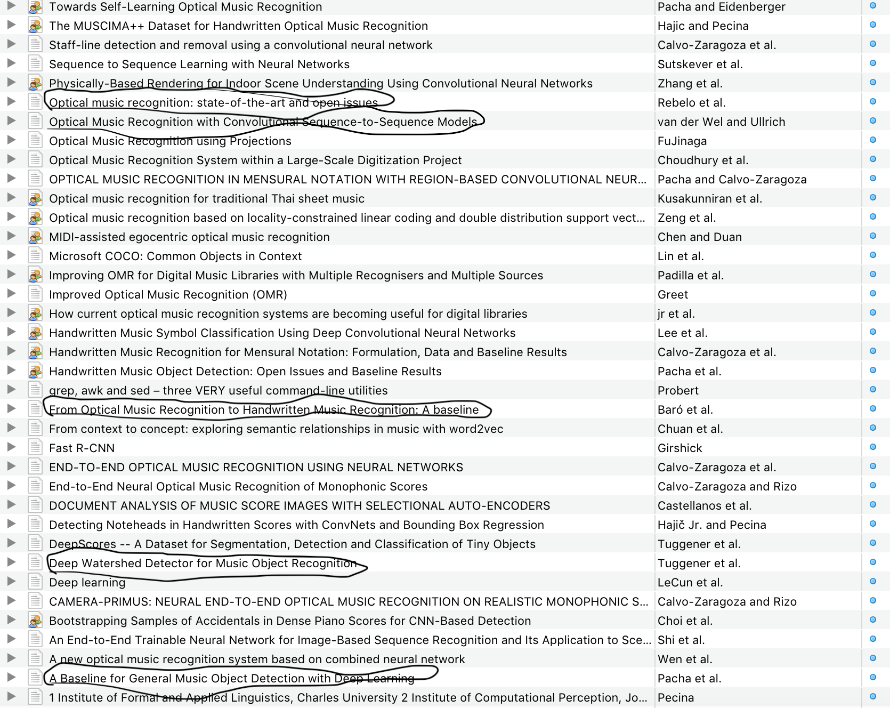

###  OMR 相关

#### omr数据集

OMR-所有的数据集: https://github.com/apacha/OMR-Datasets

| 名称                   | 风格        | 描述                                                         |
| ---------------------- | ----------- | ------------------------------------------------------------ |
| Cvc-muscima            | Handwritten | 1000张，50种特点                                             |
| muscima++              | handwritten | 基于muscima，用于符号检测                                    |
| the capitan collection | handwritten | 数据集包含10,230个不均匀分布在30个类别上的样本。             |
| MuseScore              | print       | 包含17000个单音乐谱，这些乐谱不是单音的，因此每张图像有很多行。 |
| DeepScores             | print       | 呈现在每英寸400点(dpi)。它有300,000个完整的页面作为图像，包含数千万个对象，被分成123个类。 |
|                        |             |                                                              |

#### omr 相关文章

文章划线的部分是比较有代表的工作，有兴趣可以google scholar查阅